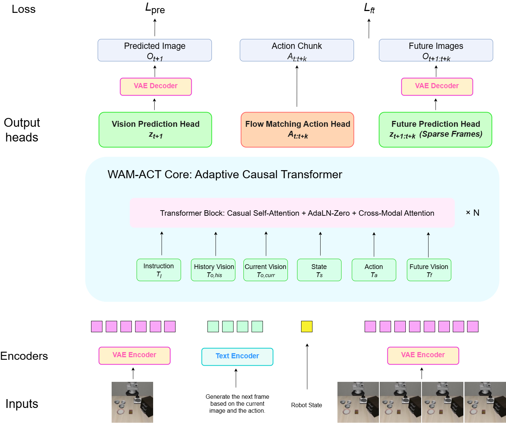

# WAM-ACT: World-Action Model with Adaptive Causal Transformer

基于图像生成的世界动作模型

## 项目概述

WAM-ACT是一个创新的世界动作模型，通过以下两个阶段进行训练：

1. **预训练阶段**: 基于当前图像预测下一帧图像，学习世界动态模型
2. **微调阶段**: 同步预测下一帧图像和Action Chunk，学习动作-视觉耦合策略

## 模型架构



## 核心创新

### 1. Diffusion Forcing 预训练
- 每帧独立噪声调度，支持任意长度自回归rollout
- 避免传统扩散模型的固定长度限制

### 2. Action-Aware Token Routing
- 动作Tokens通过可学习路由门控动态选择注意力头
- 实现动作-视觉深度耦合

### 3. Sparse Future Frame Prediction
- 仅预测稀疏关键帧(Δ步长)，减少冗余监督
- 保留关键动态演化信息

### 4. Bidirectional Consistency Loss
- 动作预测与未来帧预测互相约束
- 动作Tokens关注当前观测，未来帧Tokens关注动作

### 5. Streaming Inference with KV-Cache
- 支持实时流式推理
- 历史帧通过KV-Cache压缩，无需重复编码

## 项目结构

```
wam_act/
├── models/
│   ├── wam_act.py              # 主模型架构
│   ├── adaptive_transformer.py # 自适应因果Transformer
│   ├── diffusion_forcing.py    # Diffusion Forcing训练框架
│   ├── flow_matching_head.py   # Flow Matching动作头
│   ├── token_routing.py        # Action-Aware Token Routing
│   └── vae_encoder.py          # VAE编码器/解码器
├── data/
│   ├── robot_dataset.py        # 机器人数据集加载
│   ├── data_preprocessing.py   # 数据预处理
│   └── data_augmentation.py    # 数据增强
├── training/
│   ├── trainer.py              # 通用训练器
│   ├── pretrain.py             # 预训练脚本
│   ├── finetune.py             # 微调脚本
│   └── lr_scheduler.py         # 学习率调度
├── evaluation/
│   ├── eval_policy.py          # 策略评估
│   ├── eval_world_model.py     # 世界模型评估
│   └── metrics.py              # 评估指标
├── utils/
│   ├── config.py               # 配置文件
│   ├── logging_utils.py        # 日志工具
│   └── checkpoint.py           # 检查点管理
├── configs/
│   ├── pretrain_config.yaml    # 预训练配置
│   └── finetune_config.yaml    # 微调配置
├── scripts/
│   ├── run_pretrain.sh         # 预训练启动脚本
│   ├── run_finetune.sh         # 微调启动脚本
│   └── run_eval.sh             # 评估启动脚本
└── main.py                     # 主入口文件
```

## 安装依赖

```bash
pip install torch torchvision
pip install numpy pyyaml
pip install matplotlib pillow
```

## 使用方法

### 预训练

```bash
# 使用默认配置
bash scripts/run_pretrain.sh

# 或使用Python直接运行
python main.py --mode pretrain --config configs/pretrain_config.yaml
```

### 微调

```bash
# 使用默认配置
bash scripts/run_finetune.sh

# 或使用Python直接运行
python main.py --mode finetune --config configs/finetune_config.yaml
```

### 评估

```bash
# 使用默认配置
bash scripts/run_eval.sh

# 或使用Python直接运行
python main.py --mode eval --checkpoint outputs/finetune/checkpoints/best.pt
```

### 推理

```bash
python main.py --mode predict --checkpoint outputs/finetune/checkpoints/best.pt
```

## 训练流程

### 阶段一: 预训练 (世界模型)

```python
from wam_act.models import WAMACT
from wam_act.training import run_pretrain

# 运行预训练
trainer = run_pretrain(
    data_dir='./data/robot',
    output_dir='./outputs/pretrain',
    batch_size=32,
    num_epochs=100,
    lr=1e-4,
)
```

### 阶段二: 微调 (策略)

```python
from wam_act.training import run_finetune

# 运行微调
trainer = run_finetune(
    data_dir='./data/robot',
    pretrained_path='./outputs/pretrain/checkpoints/best.pt',
    output_dir='./outputs/finetune',
    batch_size=16,
    num_epochs=50,
    lr=1e-5,
    freeze_encoder=True,
)
```

## 评估

```python
from wam_act.models import WAMACT
from wam_act.evaluation import PolicyEvaluator, WorldModelEvaluator

# 加载模型
model = WAMACT(...)
model.load_state_dict(torch.load('checkpoint.pt')['model_state_dict'])

# 策略评估
policy_eval = PolicyEvaluator(model)
metrics = policy_eval.evaluate(val_loader)

# 世界模型评估
world_eval = WorldModelEvaluator(model)
single_step = world_eval.evaluate_single_step(val_loader)
rollout = world_eval.evaluate_multi_step_rollout(val_loader, rollout_length=8)
```

## 核心架构

### 输入
- 当前观测图像 $o_t$ (RGB)
- 语言指令 $l$ (Text)
- 本体感知状态 $s_t$ (Proprioception)
- 历史帧序列 ${o_{t-H:t}}$

### 输出
- 预训练: 下一帧Latent $\hat{z}_{t+1}$
- 微调: Action Chunk $\hat{A}_{t:t+K}$ + 未来帧Latent ${\hat{z}_{t+k}}_{k=1}^{K}$

### 损失函数

- **预训练**:

$$\mathcal{L}_{pre} = \mathbb{E} \left[ \| \hat{z}_{t+1} - z_{t+1} \|^2 \right]$$

- **微调**:

$$\mathcal{L}_{ft} = \mathcal{L}_{action} + \lambda \mathcal{L}_{future} + \mu \mathcal{L}_{consistency}$$

## 参考工作

- **Diffusion Forcing** (Chen et al., 2024): 独立噪声调度
- **MOTUS** (Bi et al., 2025): 流匹配VLA
- **GigaWorld-Policy** (2026): 稀疏帧预测
- **CogACT** (Zhao et al., 2025): DiT动作预测
- **Cosmos-Policy** (NVIDIA, 2026): 世界模型策略
- **WorldGym** (2025): 世界模型评估

